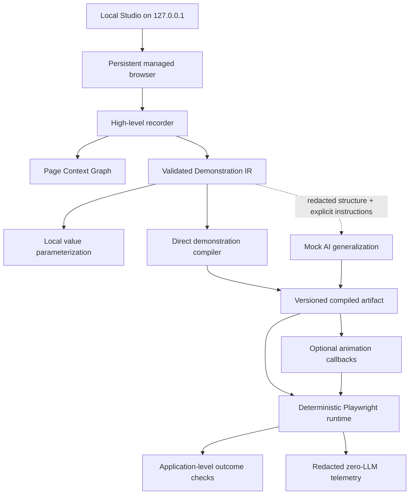
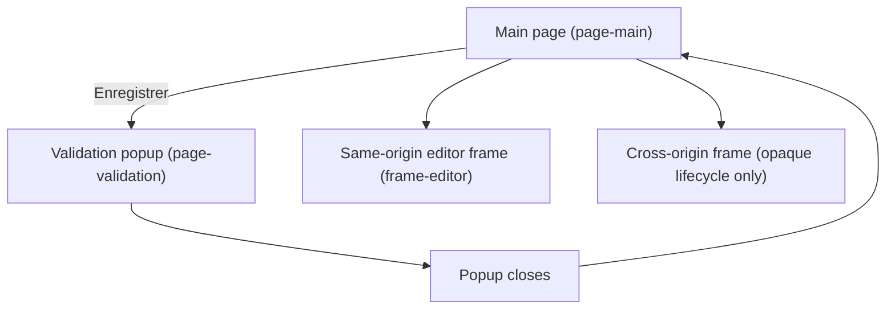

# Architecture

Visual Compiler 2 is demonstration-first. The demonstrated DOM element is the
primary evidence; natural-language generalization can refine a validated
workflow but cannot replace that target with an unrelated generic control.

## Managed browser

`packages/managed-browser` owns one persistent Playwright `BrowserContext`.
Authentication and initial navigation are manual, recording is inactive until
the operator explicitly starts teaching, and the profile remains local and
Git-ignored. Context hooks discover pages, popups, dialogs, navigation, focus
changes, and frames. Query strings may be used by the live page but are removed
from every persisted identity.

## Page Context Graph

`packages/page-context-graph` assigns stable recording-session IDs to main
pages, tabs, popups, and frames. Nodes record canonical origin/path, role,
opener/parent relationship, title pattern, structural fingerprint, and
landmarks. Page resolution never depends only on array position.

## Recorder

An initialization script observes high-level `click`, `dblclick`, `input`,
`change`, `keydown`, and `submit` events. Low-level pointer events are not
recorded. Input bursts are debounced into a single fill action. Server-side
deduplication collapses duplicate change/click reports. Password targets and
cross-origin frame content are rejected before an action enters the session.

Each demonstrated target includes semantic role/name, label, tag/input type,
editability, visibility, enabled/readonly state, form and container ownership,
neighbors, bounds, frame/page identity, stable attributes, a structural path,
and before/after fingerprints. Coordinates are evidence only.

## Demonstration IR and variables

`packages/demonstration-ir` defines Zod schemas for sessions, targets, graph
nodes, actions/effects, candidates, variables, steps, pre/postconditions,
outcomes, loops, diagnostics, artifacts, and telemetry. No unvalidated model or
disk input reaches runtime.

Typed values are converted to named references such as
`{{consultation_text}}`. Definitions are in the artifact; values are written to
the separate Git-ignored local-value store. A user can intentionally keep a
local literal or explicitly include a value in an AI instruction, but neither
choice happens silently.

## Locator engine

The exact demonstrated target is converted into several deterministic
candidates. Ranking favors:

1. role and accessible name;
2. label association;
3. stable form-control name;
4. semantic container plus role/name;
5. text/DOM relationship;
6. form ownership and stable neighboring labels;
7. same-row/same-column relationship;
8. stable application attributes;
9. structural fallback in the demonstrated container.

The engine records match/visible/enabled/editable counts, confidence, stability,
explanation, and fallback order. Non-unique or type-incompatible candidates are
rejected. Absolute coordinates are not compiled in the MVP.

## Compiler

The direct compiler faithfully translates simple demonstrations without GPT.
When the user provides generalization text, only the redacted demonstration and
that explicit text enter the versioned mock provider. Structured output is
parsed with Zod. The model boundary returns semantic decisions, never unchecked
Playwright source. Compiler modes are explicit:

- `direct-demonstration`
- `mock-ai-generalization`
- `live-gpt-generalization` (schema-defined but not enabled)

## Deterministic runtime

`packages/deterministic-runtime` receives an existing browser context, a
validated artifact, and local values. It resolves semantic page/frame contexts,
checks preconditions, executes the action, manages expected popup/dialog
lifecycles, verifies postconditions, and requires positive application outcome
evidence. It supports AbortSignal-based Stop and repeat runs.

Bounded loops stop on missing next item, duplicate row fingerprints, configured
maximum iterations, duration, first required failure, or user Stop. Defaults
are 100 iterations and ten minutes.

Animated and local execution call the same engine and artifact. Animation is a
callback layer that highlights and delays before actions; local mode supplies no
animation callbacks.

## OpenAI isolation

The runtime package does not import or depend on OpenAI. Its browser network
guard aborts requests to OpenAI domains and records an attempted-policy failure,
not a request. Compiler mocks make no network request. A future live adapter
must remain in `packages/generalization-compiler`, require explicit confirmation,
and accept only the redacted payload.
