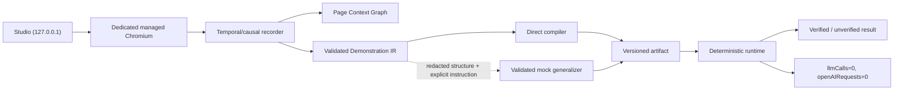

# Architecture

Visual Compiler 2 is a local demonstration compiler with one primary path:
**automatic browser open → explicit teaching → compilation → deterministic
local replay**.

## Configuration and managed browser

Normal Lab Mode defaults to `https://dpi-ncba.gbna-sante.fr/`. Test mode
requires `VISUAL_COMPILER_TEST_TARGET_URL` to be an explicit `http://localhost`
or `http://127.0.0.1` URL. This validation occurs before browser startup.

Studio initializes one persistent Playwright context automatically. Its profile
is isolated under `.local/browser-profile/`, Git-ignored and permissioned
`0700` where supported. Authentication is manual inside Chromium and recording
is inactive until **Start teaching**. Closing the main page changes browser
status to closed; reopening creates a fresh managed context using the same
dedicated local profile.

Browser status exposes only a canonical origin/path. Query strings may exist in
browser memory for the live session but are removed from persisted identities.

## Temporal and causal recorder

The browser initialization script observes high-level click, double-click,
input, change, meaningful key and submit events. Pointer noise is ignored;
typing bursts debounce into one fill; checkbox input/change noise is represented
by one check/uncheck action. Nested click targets are promoted to the closest
actionable ancestor.

Each recorded action contains:

- monotonic sequence and time offset;
- stable page/frame context ID;
- raw-target promotion evidence and normalized actionable target;
- semantic descriptor and compatible action family;
- resulting redacted structural snapshot;
- bounded DOM-reaction effects;
- a causal action ID for subsequent popup/navigation/frame events.

After every meaningful action, the recorder runs bounded DOM-quiet detection.
Stop teaching performs a final bounded reconciliation and associates late
popup, navigation, iframe replacement, history, reset, success and error
effects with the last causal action.

## Page Context Graph

`packages/page-context-graph` owns stable semantic identities for the main page,
tabs, popups and frames. Nodes contain role, opener/parent relationship,
canonical origin/path, title pattern, structural fingerprint, landmarks and
lifecycle state. Runtime reacquires live Playwright objects from those
descriptions; `Page` and `Frame` objects are never serialized as identity.
Cross-origin frame contents remain opaque.

## Targets, values and locators

Target descriptors include control family, role/name/label, static text,
editable/readonly/enabled/checked/selected state, form and semantic container,
siblings and nearby labels, page/frame evidence, stable and unstable attributes
and secondary bounds.

The locator engine ranks accessibility and stable structural evidence:

1. role and accessible name;
2. label association;
3. form-control name;
4. semantic container plus role/name;
5. text/DOM and form relationships;
6. neighbor and row/column evidence;
7. stable application attributes;
8. structural fallback.

Ambiguous, invisible, disabled or type-incompatible targets fail compilation
with structural counts and rejection reasons. Coordinates are not compiled.

Demonstrated values become local variable references. Semantic artifacts,
Git-ignored local values and optional AI instructions are separate. Values do
not enter the redacted AI preview by default.

## Compiler and outcome model

The direct compiler translates a stopped demonstration without GPT. Optional
generalization is currently handled by a strict, schema-validated mock that
makes no model request.

Compilation requires at least one executable target action, but does not
require positive outcome evidence. The compiler selects only the strongest
observed candidate. An artifact outcome carries `VERIFIED`,
`PARTIALLY_VERIFIED` or `UNVERIFIED`; positive checks are required only for a
verified outcome.

## Deterministic runtime

Local and animated modes load the same artifact into the same engine. Animation
is only a callback layer; local mode supplies none. The runtime reacquires page,
frame and popup contexts, resolves semantic locators, executes chronological
actions, checks known negative evidence and evaluates the compiled outcome.

An artifact produces `Passed` only with verified positive evidence. Successful
actions with partial/no positive evidence produce `CompletedUnverified`.
Action, locator or known application-error failures produce `Failed`.
AbortSignal produces `Stopped`.

## Diagnostics and isolation

Studio normalizes every error into one redacted persistent diagnostic. The same
object drives the visible card, clipboard text, in-memory event history,
`local-data/studio-events.jsonl` and terminal output.

The runtime has no OpenAI dependency. Managed browser routing blocks OpenAI
HTTP and WebSocket endpoints and turns attempts into policy failures. No live
AI adapter is enabled.
