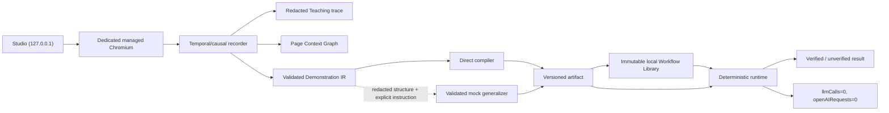

# Architecture

Visual Compiler 2 is a local demonstration compiler with one primary path:
**automatic browser open → explicit teaching → compilation → deterministic
local replay**.

## Configuration and managed browser

Normal Lab Mode defaults to `https://dpi-ncba.gbna-sante.fr/`. Test mode
requires `VISUAL_COMPILER_TEST_TARGET_URL` to be an explicit `http://localhost`
or `http://127.0.0.1` URL. This validation occurs before browser startup.

Studio initializes one persistent Playwright context automatically. Its profile
is isolated under `.local/browser-profile/`, Git-ignored and permissioned
`0700` where supported. Authentication is manual inside Chromium and recording
is inactive until **Start teaching**. Closing the main page changes browser
status to closed; reopening creates a fresh managed context using the same
dedicated local profile.

Browser status exposes only a canonical origin/path. Query strings may exist in
browser memory for the live session but are removed from persisted identities.

## Temporal and causal recorder

The BrowserContext initialization script instruments every existing/new page,
managed popup and same-origin frame. Frame attach/navigation/detach, dialog,
popup close and opener return events are observed at the context boundary.
Nested click targets are promoted to the closest actionable ancestor.

Editable focus starts a first-class transaction. The recorder captures the
semantic target immediately, then consolidates `beforeinput`, `input`, `change`,
composition, paste, meaningful keyboard and selection signals. The transaction
is durably updated as the value changes and is committed before click, submit,
navigation, frame detach, page close, popup transition, focusout or **Stop
teaching**. It never waits to reread an old DOM node after a rerender. Checkbox
input/change noise similarly becomes one check/uncheck action.

Each recorded action contains:

- monotonic sequence and time offset;
- stable page/frame context ID;
- raw-target promotion evidence and normalized actionable target;
- semantic descriptor and compatible action family;
- resulting redacted structural snapshot;
- bounded DOM-reaction effects;
- a causal action ID for subsequent popup/navigation/frame events.

After every meaningful action, the recorder runs bounded DOM-quiet detection.
Stop teaching performs a final bounded reconciliation and associates late
popup, navigation, iframe replacement, history, reset, success and error
effects with the last causal action.

Observable copy/paste is represented as explicit dataflow: an `extract` action
writes an ephemeral runtime variable and the destination edit references that
variable. The operating-system clipboard is not the runtime data channel.

## Page Context Graph

`packages/page-context-graph` owns stable semantic identities for the main page,
tabs, popups and frames. Nodes contain role, opener/parent relationship,
canonical origin/path, title pattern, structural fingerprint, landmarks and
lifecycle state. Runtime reacquires live Playwright objects from those
descriptions; `Page` and `Frame` objects are never serialized as identity.
Cross-origin frame contents remain opaque.

## Targets, values and locators

Target descriptors include control family, role/name/label, static text,
editable/readonly/enabled/checked/selected state, form and semantic container,
siblings and nearby labels, page/frame evidence, stable and unstable attributes
and secondary bounds.

The locator engine ranks accessibility and stable structural evidence:

1. role and accessible name;
2. label association;
3. form-control name;
4. semantic container plus role/name;
5. text/DOM and form relationships;
6. neighbor and row/column evidence;
7. stable application attributes;
8. structural fallback.

Ambiguous, invisible, disabled or type-incompatible targets fail compilation
with structural counts and rejection reasons. Coordinates are not compiled.

Values have an explicit persistence contract:

- `{ kind: "literal", value, persistence: "workflow" }` is an authorized
  demonstrated constant persisted in the local executable artifact;
- `{ kind: "runtime-variable", name, persistence: "memory-only" }` is produced
  by `extract`, exists only in the runtime map and is never serialized with its
  content;
- authentication-like controls and secret-shaped values are rejected before
  they enter the Demonstration IR.

Optional AI instructions and the redacted structural preview are separate from
both classes. Neither receives literal or runtime-derived content.

## Compiler and outcome model

The direct compiler translates a stopped demonstration without GPT. Optional
generalization is currently handled by a strict, schema-validated mock that
makes no model request.

For an editable action, compilation records ordered deterministic strategies:
standard Playwright fill, contenteditable fill, sequential keys,
visible-editor/backing-field synchronization and a final native setter Lab
fallback. Each strategy has target-family compatibility metadata.

Compilation requires at least one executable target action, but does not
require positive outcome evidence. The compiler selects only the strongest
observed candidate. An artifact outcome carries `VERIFIED`,
`PARTIALLY_VERIFIED` or `UNVERIFIED`; positive checks are required only for a
verified outcome.

## Deterministic runtime

Local and animated modes load the same artifact into the same engine. Animation
is only a callback layer; local mode supplies none. The runtime reacquires page,
frame and popup contexts from semantic origin/path/opener/frame ancestry,
rejects zero or ambiguous live matches, resolves semantic locators and executes
chronological actions.

Every text-entry strategy is followed by a live value check against
`input.value`, `textarea.value`, contenteditable text or the known legacy
backing field. A failed check aborts before the following click. `extract`
values stay in an internal per-run map and are discarded at completion.

An artifact produces `Passed` only with verified positive evidence. Successful
actions with partial/no positive evidence produce `CompletedUnverified`.
Action, locator or known application-error failures produce `Failed`.
AbortSignal produces `Stopped`.

## Immutable local library and forensic trace

Compiling with a workflow name creates a new private bundle and index entry
under `local-data/workflow-library/`. Versions are immutable; recompilation
appends a version and older working bundles remain readable. The index contains
canonical path patterns, verification/checksum data and last-run state but no
query strings, authentication state or runtime-derived content. Compatible
legacy compiled artifacts are loaded read-only.

Start/Stop teaching automatically opens/closes a private JSONL trace under
`local-data/teaching-traces/`. It stores bounded Before/Action/After structural
evidence, timing, target/frame identity and reaction types. Values and visible
page text are reduced to structural kinds. Only synthetic automated fixtures
may persist before/after screenshots; normal managed-browser sessions never do.

## Diagnostics and isolation

Studio normalizes every error into one redacted persistent diagnostic. The same
object drives the visible card, clipboard text, in-memory event history,
`local-data/studio-events.jsonl` and terminal output.

The runtime has no OpenAI dependency. Managed browser routing blocks OpenAI
HTTP and WebSocket endpoints and turns attempts into policy failures. No live
AI adapter is enabled.

Deliberate unsupported boundaries are cross-origin frame internals, closed
shadow DOM and application editors/copy gestures that expose no legitimate DOM
signal. The implementation does not claim universal website support.
