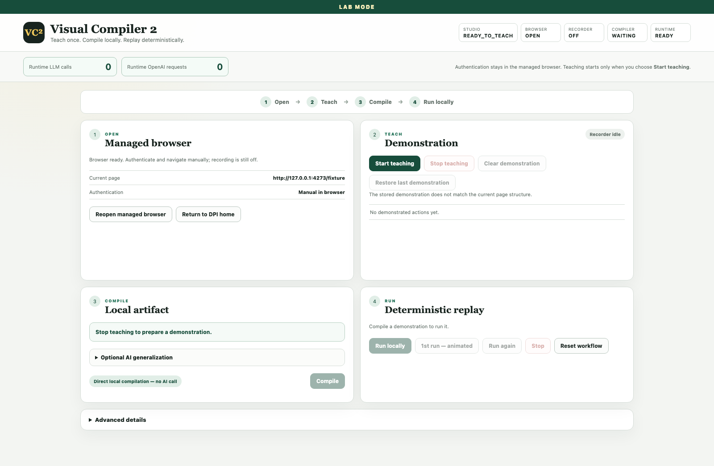
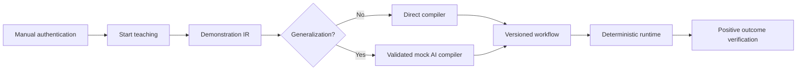

# Visual Compiler 2

**Teach once. Compile once. Run locally forever.**

Visual Compiler 2 is a local-first browser workflow compiler. A person performs
an authorized workflow once in a Playwright-managed browser. The recorder
captures the exact demonstrated elements and browser contexts, the compiler
turns that evidence into a validated deterministic artifact, and the runtime
replays the artifact locally without an LLM or OpenAI request.

> **LAB MODE — synthetic test records only**

The MVP intentionally targets the bundled synthetic DPI. It must not be used
with real patient data, real credentials, or an environment the operator is not
authorized to automate.



## Teach, compile, run



Authentication and navigation happen before recording. Typed values become
local variables by default and are omitted from the AI payload. A simple
demonstration compiles locally. Optional generalization instructions go through
a versioned, strictly validated mocked interface in this MVP; mocks are always
identified as mocks.

After compilation, **1st run — animated** and **Run locally** are both available
immediately. The animated command is an optional presentation layer. Run
locally bypasses animation and per-step confirmation. Both call the same
runtime engine with the same compiled artifact.

## Quick start

Requirements: macOS or Linux, Node.js 20+, and npm.

```bash
npm ci
npx playwright install chromium
npm run dev
```

Open <http://127.0.0.1:3100>. The synthetic DPI runs at
<http://127.0.0.1:4273/fixture?variant=A>.

1. Select **Open managed browser**.
2. Complete manual authentication/navigation if your authorized fixture needs
   it. For the bundled fixture, choose **Authentication complete**.
3. Choose **Start teaching**, edit the consultation field, and select
   **Enregistrer**.
4. Choose **Stop teaching**, review the timeline, local variables and selected
   **Application success evidence**, then **Compile**.
5. Choose either **Run locally** or **1st run — animated**.
6. Use **Run again** without teaching or compiling again.

Legacy DPI layout A deliberately replaces its same-origin editor frame after
**Enregistrer** and appends a synthetic history row. Compilation resolves the
new live control from a stable `DemonstratedTargetDescriptor` (control family,
action compatibility, accessibility semantics, form/container relationships
and canonical frame context), not from a DOM object, generated ID/class, field
value, history contents, or page-instance fingerprint.

Click-like events are normalized to their actionable ancestor before they enter
the demonstration IR. A click on the `<span>` or an image nested inside
**Enregistrer**, for example, records the owning link rather than the nested
node. The compiler then prefers an exact role/name, exact actionable text,
same-form and same-container evidence in that order. The demonstrated
fill-then-save relationship scopes duplicate action names and ambiguous
unscoped matches still fail closed.

## Stable application outcomes

Stop teaching performs a bounded final reconciliation instead of trusting the
state immediately after the click. Studio waits for a 500 ms DOM quiet period,
up to a configurable five-second maximum, then reconciles same-page mutations,
frame replacement, popup lifecycle and the final Page Context Graph.

For the consultation workflow, the recommended positive outcome is a relative
scoped postcondition: the consultation-history count must increase by at least
one. The compiled artifact stores no absolute row count and each Run locally or
Run again captures a fresh baseline. Popup completion, return to the canonical
page, editor reset, and unchanged Date/Heure fields are additional required
evidence. Known application errors still fail before positive evidence can
produce Passed.

The **Application success evidence** review shows observed and rejected
candidates before Compile. Evidence can be selected, deselected, made required,
recaptured from the stable current state, or explicitly accepted as the
demonstrated current success state. A missing history increment cannot be
replaced by mere absence of an error.

The managed browser profile is stored only under `browser-profiles/` and is
Git-ignored. Workflow values live separately under `local-data/` and are also
Git-ignored.

## Restore a completed demonstration

When teaching stops, Studio stores the last completed synthetic demonstration
under `local-data/last-demonstration/`. Structural session data, local runtime
values and compatibility metadata use separate files. No query parameter,
authentication state, cookie or token is stored. After a Studio restart:

1. Open and authenticate the same synthetic profile.
2. Confirm Studio reports the stored structure as compatible.
3. Choose **Restore last demonstration**, then compile or retry directly.

Restore is disabled and the backend refuses the operation if the synthetic
profile or live structural fingerprint is incompatible. Legacy stored sessions
remain readable; if they predate scoped before/after counts and outcome
candidates, Studio shows the missing evidence rather than silently weakening
compilation.

## Browser and popup handling

Each page, popup, tab, and same-origin frame gets a stable session identity in a
Page Context Graph. Artifacts use canonical origins and paths without query
parameters. Opener relationships, page roles, title patterns, structural
fingerprints, and expected landmarks are used instead of numeric page order.
Cross-origin frames are opaque. Popup creation, action, closure, and return to
the opener are represented explicitly.

**Reset synthetic fixture** clears only the fixture’s in-memory synthetic save
history and returns the selected layout to its initial state. It does not reset
Studio or delete an already compiled workflow.

## Compilation diagnostics and retry

A rejected compile returns Studio to `DEMONSTRATION_REVIEW`; the demonstration,
local variables and instruction remain available, and **Retry compile** is
enabled as soon as the HTTP request finishes. The persistent **Compilation
diagnostics** panel remains until the next compile or an explicit Clear action.
It includes the HTTP status, compiler stage, redacted message and, for locator
rejections, the step/action identity, actionable target family, raw-target
promotion, static-name presence, form/container match counts, aggregate
candidate counts and per-strategy rejection reasons. **Copy diagnostics**
copies that same redacted record. The diagnostic is appended to the persistent
local Studio event log and terminal. Form values, dynamic editor contents,
query parameters, cookies, tokens and authentication data are excluded.
Application-outcome failures add only structural before/after counts, candidate
types, popup/page/reset/stability flags, the selected outcome type, and
redacted rejection reasons.

## AI generalization and local variables

The Studio keeps three inputs visibly separate:

- **Demonstration:** actions and redacted structure captured from the browser.
- **AI generalization instructions:** the only free text intentionally included
  in the mocked compile-time AI payload.
- **Local runtime variables:** demonstrated values used by local execution and
  not included in the AI payload by default.

The **Payload sent to AI** preview strips query parameters, secrets, form
values, patient-like identifiers, cookies, tokens, storage, and authorization
state. The repository contains no API key and automated development makes no
live model call.

## Zero-LLM runtime proof

The runtime package has no OpenAI dependency and works with
`OPENAI_API_KEY` unset. It rejects OpenAI-domain HTTP and WebSocket traffic and
always reports:

```json
{
  "llmCalls": 0,
  "openAIRequests": 0
}
```

Security tests statically reject OpenAI imports in the runtime and exercise the
network blocker.

## Commands

```bash
npm run build
npm test
npm run test:security
npm run test:e2e
```

## Privacy boundaries

Visual Compiler 2 never records password values, cookies, tokens, browser
storage, authorization headers, URL query parameters, or a complete sensitive
screenshot. Authentication is manual. Studio binds to `127.0.0.1` by default.
Runtime telemetry is structural and redacted.

## Supported platforms and limitations

The primary MVP target is a local Mac with Chromium. Linux is supported for
headless automated tests. Cross-origin frames are lifecycle-only opaque
contexts. The GPT-5.6 interface is mocked and schema-validated; a live
compile-time adapter is deliberately not enabled. The visual review editor
supports step rename, delete, optionality, variable naming, and success evidence
but is not a general Playwright code editor.

## Roadmap

- Explicitly authorized live GPT-5.6 compile-time adapter.
- Richer repeated-row demonstration and visual loop editor.
- More legacy editor adapters and structural compatibility probes.
- Signed artifact bundles and expanded migration tooling.

See [ARCHITECTURE.md](ARCHITECTURE.md), [SECURITY.md](SECURITY.md),
[MIGRATION_NOTES.md](MIGRATION_NOTES.md), and [DECISIONS.md](DECISIONS.md).
